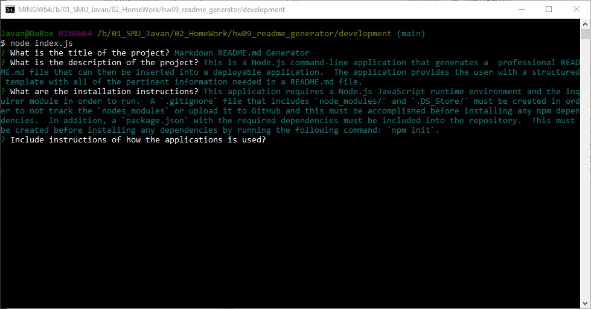
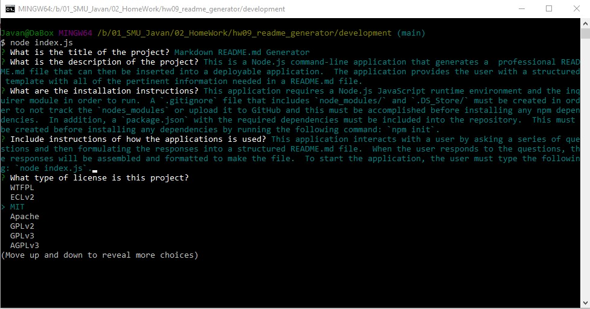

# Markdown README.md Generator

  

***

  ## Description:
  This is a Node.js command-line application that generates a  professional README.md file that can then be inserted into a deployable application.  The application provides the user with a structured template with all of the pertinent information needed in a README.md file.

***
  ## Demostration:
  [Video Demo](https://youtu.be/iIibQGXP4Os)
***
  ## Table of Contents:
  1.  [Description](#description)
  9.  [Demostration](#demostration)
  2.  [Installation](#installation)
  3.  [Usage](#usage)
  8.  [Screenshots](#screenshots)
  4.  [License](#license)
  5.  [Contributing](#contributing)
  6.  [Tests](#tests)
  7.  [Questions](#questions)

***
  ## Installation:
  This application requires a Node.js JavaScript runtime environment and the inquirer module in order to run.  A `.gitignore` file that includes `node_modules/` and `.DS_Store/` must be created in order to not track the `nodes_modules` or upload it to GitHub and this must be accomplished before installing any npm dependencies.  In addition, a `package.json` with the required dependencies must be included into the repository.  This must be created before installing any dependencies by running the following command: `npm init`.

***
  ## Usage:
  This application interacts with a user by asking a series of questions and then formulating the responses into a structured README.md file.  When the user responds to the questions, the responses will be assembled and formatted to make the file.  To start the application, the user must type the following: `node index.js`.
   
***
## Screenshots 
### (Invoking Application and Responding to Questions)

### (User Prompts with Choices)

***
  ## License:
  This project falls under the MIT License.  The full documentation for this license can be found at [MIT Full Documentation](https://choosealicense.com/licenses/mit).

  Below is an excerpt of the MIT License.
   
  Copyright <YEAR> <COPYRIGHT HOLDER>
    
    Permission is hereby granted, free of charge, to any person obtaining a copy of this software and associated documentation files (the "Software"), to deal in the Software without restriction, including without limitation the rights to use, copy, modify, merge, publish, distribute, sublicense, and/or sell copies of the Software, and to permit persons to whom the Software is furnished to do so, subject to the following conditions:
    The above copyright notice and this permission notice shall be included in all copies or substantial portions of the Software.
    THE SOFTWARE IS PROVIDED "AS IS", WITHOUT WARRANTY OF ANY KIND, EXPRESS OR IMPLIED, INCLUDING BUT NOT LIMITED TO THE WARRANTIES OF MERCHANTABILITY, FITNESS FOR A PARTICULAR PURPOSE AND NONINFRINGEMENT. IN NO EVENT SHALL THE AUTHORS OR COPYRIGHT HOLDERS BE LIABLE FOR ANY CLAIM, DAMAGES OR OTHER LIABILITY, WHETHER IN AN ACTION OF CONTRACT, TORT OR OTHERWISE, ARISING FROM, OUT OF OR IN CONNECTION WITH THE SOFTWARE OR THE USE OR OTHER DEALINGS IN THE SOFTWARE.

  ## Contributing:
  The contributors for this project are: D. Javan Worthy.
   
  To contribute to this project, please submit pull requests for any minor changes; however, please open an issue for any changes that are significant.

***
  ## Tests:
  There are no special tests that need to be run for this application.

***
  ## Questions:
  - The GitHub profile for this project is https://github.com/djavanw.
 
  - If there are any questions, the contributor can be reached at djavanw@ghittohubb.net.

